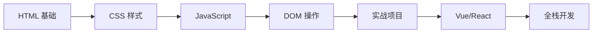

# 🚀 前端入门学习指南

恭喜你完成了第一个前端项目！这是一个完整的个人主页，包含了现代网页开发的三大核心技术。

## ⚡ 5 分钟快速开始

### 方法一：直接打开（最简单）
```bash
双击 index.html 文件，浏览器会自动打开它。
```

### 方法二：使用 VS Code Live Server（推荐）
```bash
1. 在 VS Code 中安装 "Live Server" 扩展
2. 右键点击 index.html
3. 选择 "Open with Live Server"
4. 浏览器会自动打开，并且修改代码后会自动刷新！
```

### 方法三：使用 Python 简易服务器
```bash
# 在项目目录下运行
python -m http.server 8000

# 然后在浏览器访问
http://localhost:8000
```

---

## 📁 项目结构详解

```
thefor/
├── index.html          # 主页面（142 行）
│                       # - 导航栏
│                       # - 个人介绍
│                       # - 技能展示
│                       # - 联系表单
│
├── style.css           # 样式文件（350 行）
│                       # - 响应式设计
│                       # - 动画效果
│                       # - 渐变背景
│
├── script.js           # 交互脚本（227 行）
│                       # - DOM 操作
│                       # - 事件处理
│                       # - 数字动画
│
├── README.md           # 本说明文档
├── COMPLETE_TUTORIAL.md # 完整教程（HTML/CSS/JS）
└── LEARNING_GUIDE.md   # 系统化学习指南
```

---

## 🎯 核心概念解析

### 1️⃣ HTML - 超文本标记语言

**作用**：构建网页的基本结构，就像房子的框架

**你学到的标签**：
- `<!DOCTYPE html>` - 声明文档类型
- `<html>` - 根元素
- `<head>` - 元信息（不显示）
- `<body>` - 可见内容
- `<nav>`, `<header>`, `<section>`, `<footer>` - 语义化标签
- `<div>`, `<span>` - 通用容器
- `<h1>`-`<h6>` - 标题
- `<p>` - 段落
- `<a>` - 链接
- `<button>` - 按钮
- `<input>`, `<textarea>` - 表单输入
- `<ul>`, `<li>` - 列表

**关键属性**：
- `id` - 唯一标识符，用于 CSS 和 JS 定位
- `class` - 类名，用于分组样式
- `href` - 链接地址
- `src` - 资源路径

---

### 2️⃣ CSS - 层叠样式表

**作用**：美化网页，控制布局、颜色、字体等

**你学到的概念**：

#### 选择器
```css
* { }              /* 通配符选择器 */
body { }           /* 元素选择器 */
.class-name { }    /* 类选择器 */
#id-name { }       /* ID 选择器 */
```

#### 盒模型（Box Model）
每个 HTML 元素都是一个盒子：
- **content** - 内容区域
- **padding** - 内边距（内容与边框之间）
- **border** - 边框
- **margin** - 外边距（与其他元素的距离）

#### Flexbox 布局
```css
display: flex;
justify-content: space-between;  /* 主轴分布 */
align-items: center;             /* 交叉轴对齐 */
gap: 20px;                       /* 间距 */
```

#### Grid 布局
```css
display: grid;
grid-template-columns: repeat(3, 1fr);  /* 三列等宽 */
```

#### 过渡和动画
```css
transition: all 0.3s ease;  /* 平滑过渡 */
transform: translateY(-5px); /* 变换 */
```

#### 响应式设计
```css
@media (max-width: 768px) {
    /* 在小屏幕上的样式 */
}
```

---

### 3️⃣ JavaScript - 网页编程语言

**作用**：让网页具有交互性和动态功能

**你学到的概念**：

#### DOM 操作
```javascript
// 获取元素
document.getElementById('myId');
document.querySelector('.myClass');

// 修改内容
element.textContent = '新文本';
element.innerHTML = '<strong>HTML 内容</strong>';

// 修改样式
element.style.color = 'red';
```

#### 事件监听
```javascript
element.addEventListener('click', function() {
    // 点击时执行的代码
});

element.addEventListener('submit', function(event) {
    event.preventDefault(); // 阻止默认行为
});
```

#### 定时器
```javascript
// 延迟执行
setTimeout(() => { }, 1000);

// 重复执行
setInterval(() => { }, 1000);
```

#### Date 对象
```javascript
const now = new Date();
now.getFullYear();  // 年份
now.getMonth();     // 月份（0-11）
now.getDate();      // 日期
```

---

## 🎨 动手练习

### 练习 1：个性化你的主页
1. 修改 HTML 中的文字内容
2. 在 `setUserName()` 函数中改成你的名字
3. 调整 CSS 中的颜色值

### 练习 2：添加新功能
尝试添加一个"暗色模式"切换按钮：

**HTML**：
```html
<button id="theme-toggle">🌙 切换主题</button>
```

**JavaScript**：
```javascript
document.getElementById('theme-toggle').addEventListener('click', () => {
    document.body.classList.toggle('dark-mode');
});
```

**CSS**：
```css
body.dark-mode {
    background: linear-gradient(135deg, #1a1a2e 0%, #16213e 100%);
    color: #eee;
}
```

### 练习 3：学习挑战
- ✅ 添加一个新的技能条（比如 Vue 或 React）
- ✅ 在页脚添加社交媒体链接图标
- ✅ 创建一个模态框（弹窗）
- ✅ 实现滚动动画（元素进入视口时淡入）

---

## 🔧 常见问题排查

### 问题 1：网页显示空白
**可能原因**：
- 文件路径错误
- JavaScript 报错阻止渲染

**解决方法**：
```
1. 按 F12 打开开发者工具
2. 查看 Console 标签是否有红色错误
3. 检查 CSS 和 JS 文件是否在同一目录
4. 确保文件名完全一致（区分大小写）
```

---

### 问题 2：样式不生效
**可能原因**：
- 浏览器缓存
- CSS 选择器优先级问题
- 文件未正确链接

**解决方法**：
```
1. 按 Ctrl+F5 强制刷新（清除缓存）
2. 在 Elements 面板检查元素是否应用了样式
3. 检查 <link> 标签的 href 是否正确
4. 查看 Network 面板确认 CSS 文件加载成功
```

---

### 问题 3：JavaScript 不工作
**可能原因**：
- 代码语法错误
- 元素未加载就执行 JS
- 选择器错误

**解决方法**：
```
1. 打开 Console 查看错误信息
2. 确保 <script> 标签在 </body> 之前
3. 使用 DOMContentLoaded 事件
4. 检查 getElementById 的 ID 是否正确
```

---

### 问题 4：中文显示乱码
**解决方法**：
```
1. 确保 HTML 中有：<meta charset="UTF-8">
2. 在 VS Code 右下角确认编码为 UTF-8
3. 如果不是，点击 → "通过编码保存" → 选择 UTF-8
```

---

### 问题 5：移动端显示异常
**解决方法**：
```
1. 确保有 viewport meta 标签
2. 检查媒体查询断点是否正确
3. 使用 Chrome 开发者工具的移动设备模拟功能测试
```

---

## 🛠️ 开发工具推荐

### 浏览器开发者工具（F12）
- **Elements** - 查看和修改 HTML/CSS
- **Console** - 查看日志和调试
- **Sources** - 断点调试 JavaScript
- **Network** - 查看网络请求
- **Performance** - 性能分析
- **Application** - 查看本地存储

### VS Code 扩展推荐
- **Live Server** - 实时预览
- **Prettier** - 代码格式化
- **Auto Close Tag** - 自动闭合标签
- **Auto Rename Tag** - 自动重命名配对标签
- **CSS Peek** - 快速查看 CSS
- **IntelliSense for CSS** - CSS 智能提示
- **Chinese Language Pack** - 中文界面

### 在线工具
- [CodePen](https://codepen.io/) - 在线代码演示
- [JSFiddle](https://jsfiddle.net/) - 在线编辑和分享
- [Can I Use](https://caniuse.com/) - 浏览器兼容性查询
- [CSS Gradient](https://cssgradient.io/) - 渐变生成器

---

## 📖 下一步学习路线

### 阶段 1：巩固基础（1-2 周）
- ✅ HTML5 语义化标签
- ✅ CSS3 高级特性（动画、渐变）
- ✅ JavaScript ES6+ 语法
- ✅ 完成 3-5 个小项目

### 阶段 2：进阶提升（2-3 周）
- JavaScript 异步编程（Promise, async/await）
- Fetch API 和数据请求
- LocalStorage 本地存储
- 模块化开发（import/export）

### 阶段 3：现代框架（3-4 周）
- 选择 Vue.js 或 React
- 组件化开发思想
- 状态管理（Vuex/Redux）
- 路由（Vue Router/React Router）

### 阶段 4：工程化（2-3 周）
- Node.js 和 npm
- 构建工具（Vite/Webpack）
- Git 版本控制
- 代码规范和 ESLint

### 阶段 5：全栈探索（可选）
- Express/Koa 后端框架
- 数据库（MongoDB/MySQL）
- RESTful API 设计
- 部署和运维

---

## 💡 学习建议

### 1. 多动手实践
```
❌ 不要只看教程
✅ 一定要自己敲代码
✅ 修改示例看效果
✅ 尝试不同的写法
```

### 2. 善用搜索
```
遇到问题时的搜索顺序：
1. 阅读错误信息
2. Google/百度搜索
3. Stack Overflow
4. MDN 文档
5. GitHub Issues
```

### 3. 阅读官方文档
```
最佳学习资源：
- MDN Web Docs（最权威）
- W3C Standards（标准规范）
- 框架官方文档
```

### 4. 做项目驱动学习
```
推荐项目：
✓ 待办事项列表（Todo List）
✓ 天气应用
✓ 计算器
✓ 个人博客
✓ 电商网站（简化版）
```

### 5. 加入社区
```
- GitHub - 开源项目
- Stack Overflow - 问答
- 知乎 - 经验分享
- Reddit r/webdev - 国际社区
- V2EX - 国内技术社区
```

---

## 🔗 优质资源

### 文档教程
- [MDN Web Docs](https://developer.mozilla.org/zh-CN/) - 最权威的 Web 技术文档
- [菜鸟教程](https://www.runoob.com/) - 中文入门教程
- [freeCodeCamp](https://www.freecodecamp.org/) - 免费互动学习平台
- [W3Schools](https://www.w3schools.com/) - 快速参考

### 视频课程
- Bilibili - 大量免费前端教程
- YouTube - Traversy Media, The Net Ninja
- Udemy - 系统课程（付费）
- Coursera - 大学课程

### 练习平台
- [CodePen](https://codepen.io/) - 在线代码演示
- [JSFiddle](https://jsfiddle.net/) - 在线编辑和分享
- [LeetCode](https://leetcode.cn/) - 算法练习
- [Frontend Mentor](https://www.frontendmentor.io/) - 真实项目挑战

### 博客和社区
- [CSS-Tricks](https://css-tricks.com/) - CSS 技巧
- [Dev.to](https://dev.to/) - 开发者社区
- [掘金](https://juejin.cn/) - 中文技术社区
- [SegmentFault](https://segmentfault.com/) - 思否

---

## ❓ 常见问题

**Q: 我应该学哪个框架？**
```
A: 先打好 JavaScript 基础！然后：
   - Vue.js：容易上手，中文文档好
   - React：更流行，生态更大
   - Angular：企业级，学习曲线陡
   
   建议：Vue → React
```

**Q: 需要学 Node.js 吗？**
```
A: 前端开发需要了解基础的 Node.js：
   ✓ 运行构建工具（Vite/Webpack）
   ✓ 安装包管理器（npm/yarn）
   ✓ 理解前后端分离
   
   不需要深入后端开发，但要会用。
```

**Q: 多久能找到工作？**
```
A: 因人而异，一般情况：
   - 系统学习 3-6 个月可以入门
   - 做出 3-5 个项目可以投简历
   - 持续学习是关键
   
   重要的是能力，不是时间。
```

**Q: 数学不好能学前端吗？**
```
A: 完全可以！
   前端开发对数学要求不高：
   ✓ 基本逻辑思维能力
   ✓ 空间想象力（布局）
   ✓ 学习能力
   
   不需要高等数学知识。
```

**Q: 英语不好怎么办？**
```
A: 逐步提升：
   1. 先看中文教程入门
   2. 学习常用英文术语
   3. 使用浏览器翻译插件
   4. 慢慢过渡到英文文档
   
   MDN 有中文版，是很好的起点。
```

---

## 🤝 参与贡献

欢迎提出改进建议！

### 如何贡献
1. Fork 本项目
2. 创建分支 (`git checkout -b feature/YourFeature`)
3. 提交更改 (`git commit -m 'Add some feature'`)
4. 推送到分支 (`git push origin feature/YourFeature`)
5. 提交 Pull Request

### 贡献内容
- 📝 修正文档错误
- 💡 添加新的示例
- 🐛 修复代码问题
- 🎨 改进样式设计
- 📚 补充学习内容

---

## 📄 许可证

本项目仅供学习使用。

---

## 🎉 总结

你已经完成了：
- ✅ 第一个 HTML 页面
- ✅ 第一个 CSS 样式表
- ✅ 第一个 JavaScript 交互功能
- ✅ 第一个完整的前端项目

**记住**：每个大神都是从第一行代码开始的。保持好奇，持续学习，你一定能成为优秀的前端工程师！

### 学习路线图


### 关键里程碑
- 🎯 第 1 周：完成 HTML/CSS 基础
- 🎯 第 2-3 周：掌握 JavaScript 基础
- 🎯 第 4 周：完成第一个项目
- 🎯 第 2 个月：学习现代框架
- 🎯 第 3 个月：做出作品集
- 🎯 第 6 个月：准备求职

---

有任何问题，随时查阅 MDN 文档或在社区提问。加油！💪

📅 创建时间：2024
🔄 最后更新：2026-04-19
👤 作者：xiaowei
⭐ 如果这个项目对你有帮助，请给个 Star！
